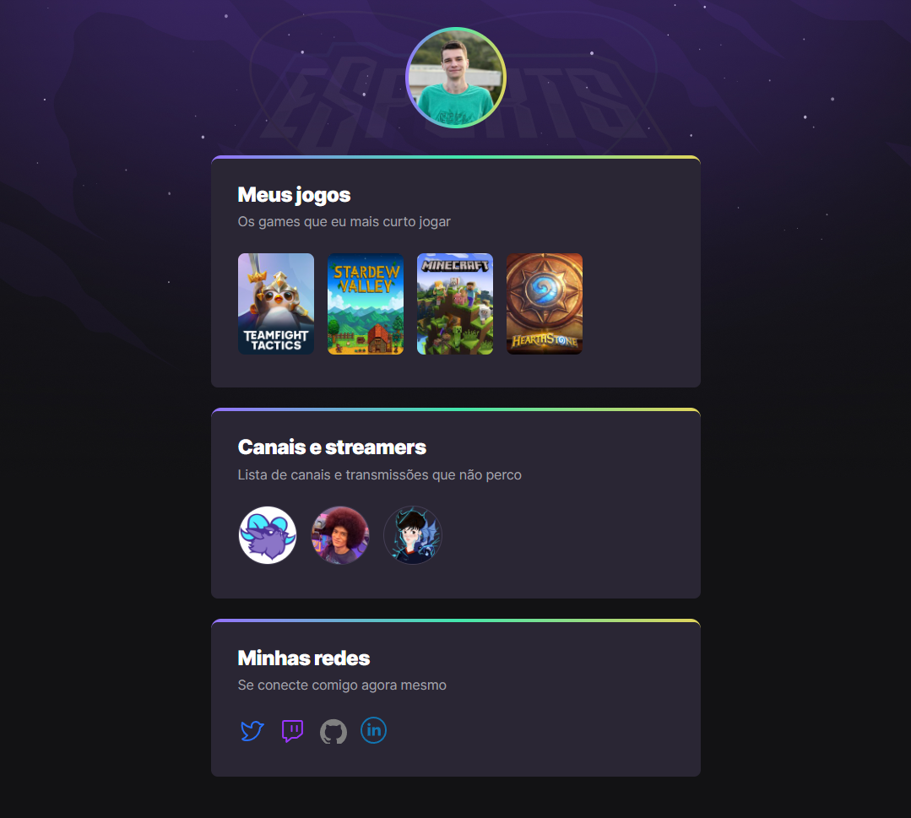

# NLW eSports - 

> Trilha Explorer

Projeto construído no evento Next Level Week (NLW) da Rocketseat.

[📎 Clicando aqui você pode acessar esse projeto!](https://bfalconi.github.io/nlw-esports-explorer)

## 💻 Tecnologias

- HTML
- CSS
- Git e Github

## 📝 Sobre minha experiência no projeto

Esse foi meu primeiro projeto e também meu primeiro contato com a área da programação e suas tecnologias. Eu estava iniciando os vídeos da seção Discover da Rocketseat quando vi a abertura da NLW e resolvi me aventurar nesse desafio mesmo sabendo pouquíssimo da área. Achei muito desafiador e ao mesmo tempo enriquecedora essa experiência. A forma como foi apresentada o conteúdo me permitiu saber como funciona de forma bem detalhada diversas funções de HTML, CSS, Git e Github.

## 📩 Contato

dgabrielfalconi@gmail.com